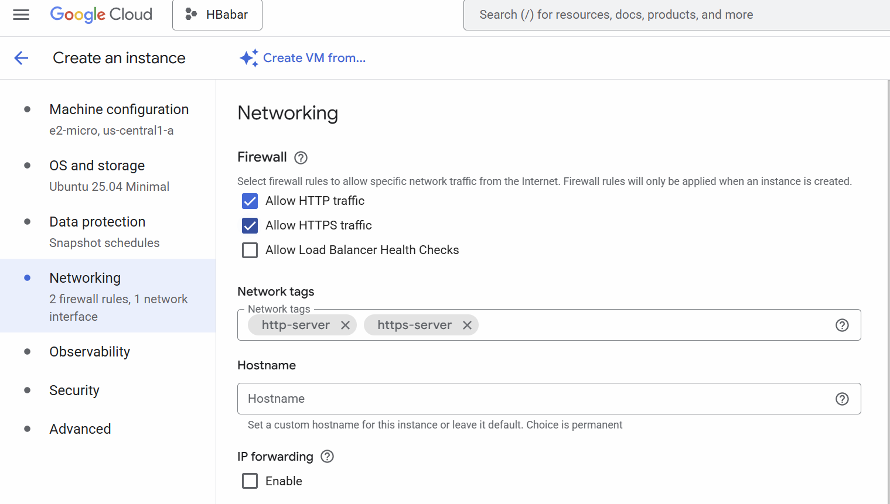

# Flask on Cloud VM (Assignment 2)

## Student Info
- Name:  Huma Babar
- Cloud Provider: GCP

## Video recording: 
- Zoom/Loom: 

## Steps
### 1. VM Creation

### 2. Networking (Port 5003 Open)

### 3. OS Update + Python Install

### 4. Flask App Running

### 6. Public IP Access
URL: http://34.28.245.116:5003/
