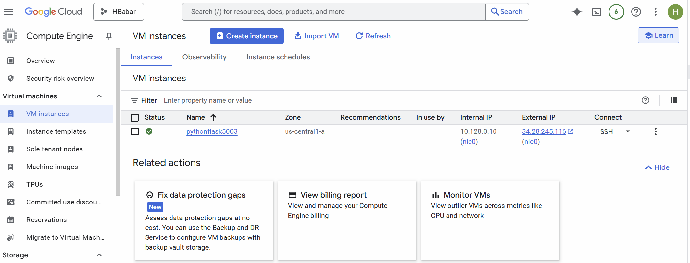
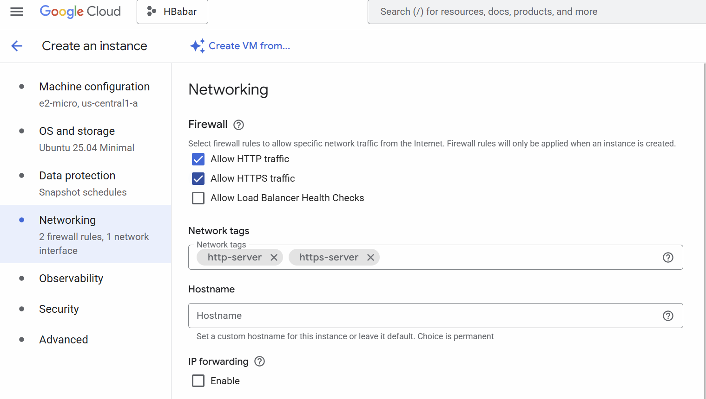
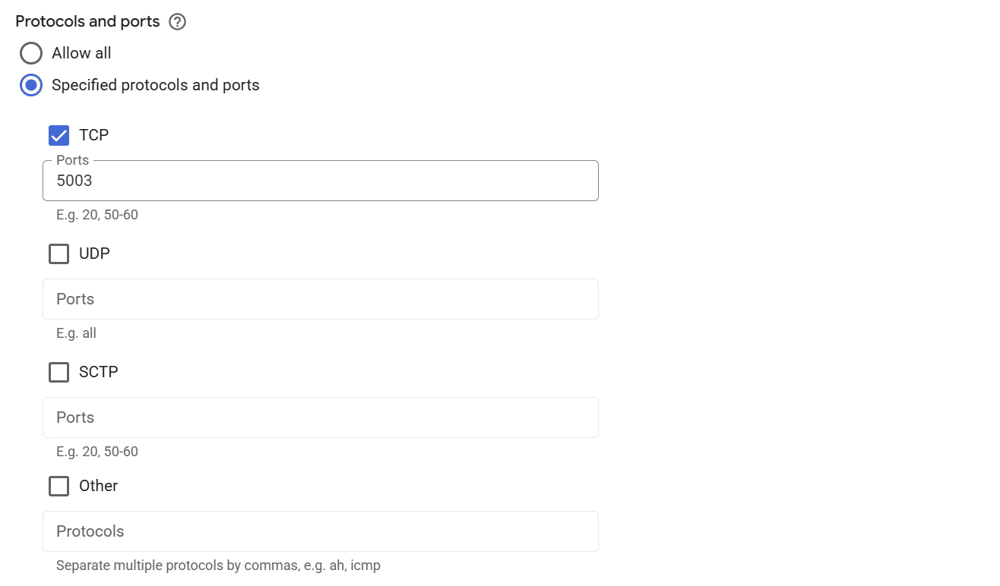
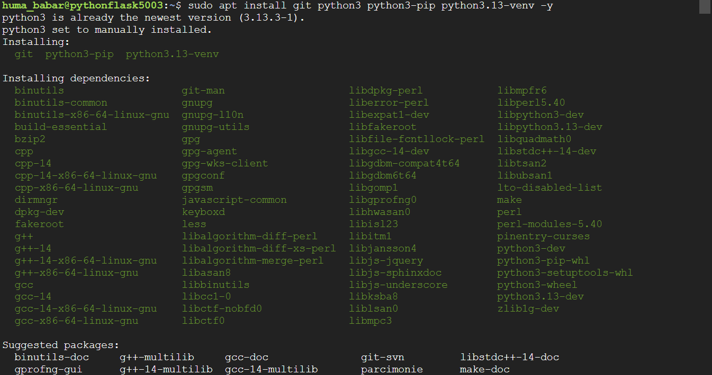
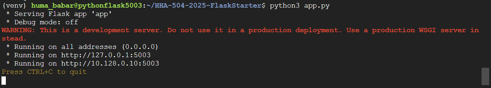
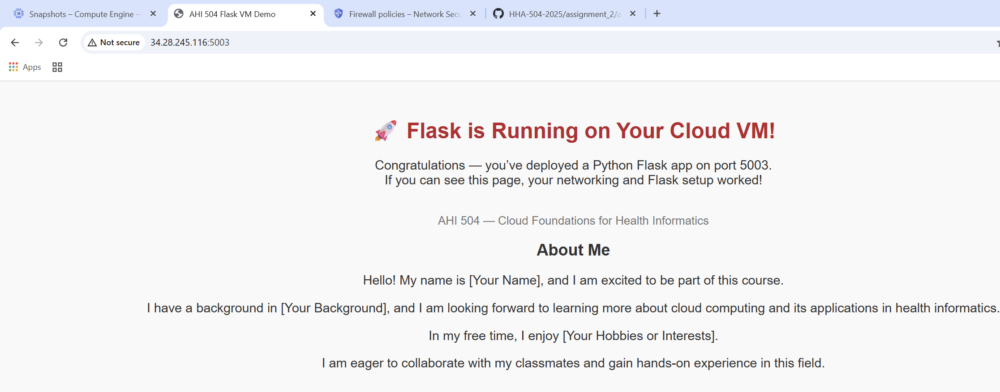

# Flask on Cloud VM (Assignment 2)

## Student Info
- Name:  Huma Babar
- Cloud Provider: GCP

## Video recording: 
- Zoom/Loom: [Flask on GCP](https://drive.google.com/file/d/1z4wg_7Bw6ouj-tk-c1jjwOp5dDXyGdIQ/view?usp=sharing)

## Steps
### 1. VM Creation
- Click "Create instance" and create free tier eligible vm (e2-micro)
- **Name**: pythonflask5003
- **OS image**: Ubuntu LTS (recommended)

### 2. Firewall
- In the firewall settings allow HTTP and HTTPS 

### 3. Networking (Port 5003 Open)
- Create a firewall rule to open port 5003 for Flask.
    - **Name**: python-flask-5003
    - **Targets**: All instances in the network
    - **Source IPv4 ranges**: 0.0.0.0/0
    - **Protocols and ports**: Specified protocols and ports> select "TCP"> type in "5003"> select "create"

### 4. OS Update + Python Install
- From the VM instance we just created, click on **"SSH"**
- **Run the following commands**: `sudo apt update && sudo apt upgrade -y` to update packages
- `sudo apt install git python3 python3-pip python3.13-venv -y` to install git, python, and pip

### 5. Clone the repo
`git clone https://github.com/hantswilliams/HHA-504-2025-FlaskStarter.git` 
cd HHA-504-2025-FlaskStarter to go into the correct directory (folder)
and run the following commands: 
- **First create a new virutal environment**: `python3 -m venv venv`
- **Then activate virtual environment**: `source venv/bin/activate`
- **Install requirements**: `pip install -r requirements.txt` 

### 6. Flask App Running
- Run the app on port 5003 with the following command: `python3 app.py` 

### 7. Public IP Access
- Click on your VM's external IP 
- Be sure to open on **http**: http://34.28.245.116:5003/
    - Note: The vm was disabled therefore link is not accessible.  

